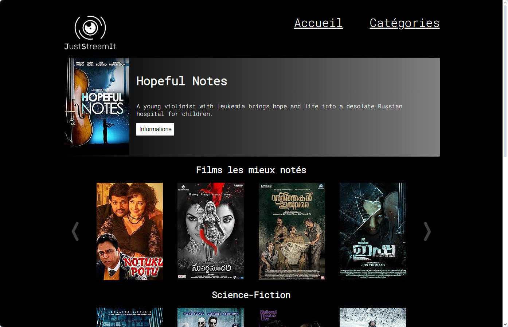
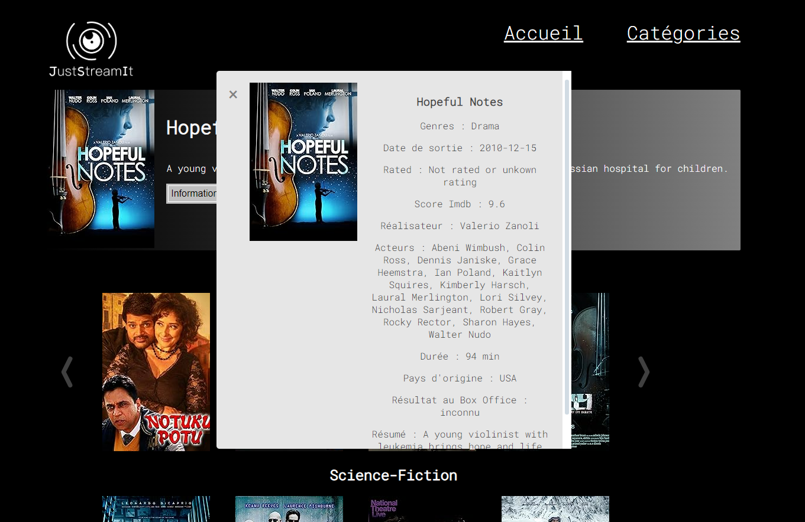
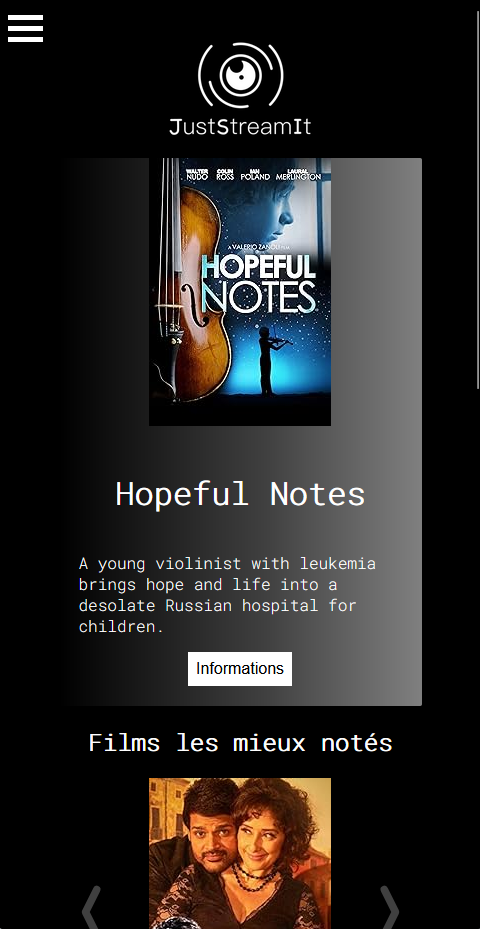

# Project 6 of the OpenClassRoom Python developper training

## Develop a User Interface for a web Python application

This project is a website in HTML, CSS and vanilla JavaScript displaying films for streaming.

The movies data are retrieved using the API located in the repository https://github.com/OpenClassrooms-Student-Center/OCMovies-API-EN-FR

## Installation

### API intallation

To install and start the API follow the instructions from the readme of the API repository.

### Website installation

Clone the following repository in the directory where you want your website to be stored : https://github.com/chpancrate/ocrpy_project6

Open the file index.html with a browser with CORS disabled or using VSCode and Live Server. The API must already be started.

## Screenshots

### Homepage

### Modal

### Responsive design

